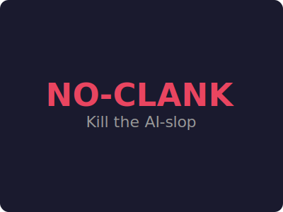

# No-Clank



*Are you tired of AI-generated clankerspeech slop? Me too.*

---

**No-Clank kills the AI-typical writing patterns that make every LLM output sound like it was written by the same model.**

Contrastive parallelism. Gratuitous em dashes. "Delve." "Navigate the landscape." "It's not just a tool — it's a philosophy." "Certainly! Let's dive in."

You know the sound. This stops it.

## Before / After

**You ask: "How does this algorithm work?"**

Without No-Clank:

> When exploring the intricate landscape of algorithmic paradigms, it's crucial to understand that this isn't merely about sorting data — it's a testament to the elegant tapestry of computational thinking. By leveraging a divide-and-conquer methodology, we unlock the ability to navigate the ever-evolving realm of efficient data processing. Fast, scalable, and robust. But what does this actually mean for you? It means you're not just sorting — you're orchestrating a symphony of data.

With No-Clank:

> It splits the input in half, sorts each half recursively, then merges them. The merge step is where the comparison happens.

---

**You ask: "What's the right tool for this job?"**

Without No-Clank:

> In today's fast-paced, ever-changing development landscape, selecting the appropriate tool is a journey that requires careful consideration of multifaceted requirements. Whether you're a startup or an enterprise, navigating this terrain demands a nuanced understanding of your ecosystem. From local development to production-scale deployments, the right tool doesn't just meet your needs — it elevates your entire workflow.

With No-Clank:

>  `sqlite3`. Single file, no server, zero setup. Add `pg` when you have multiple writers.

---

**You ask for a commit message.**

Without No-Clank:

> This commit introduces a robust authentication enhancement that seamlessly integrates with our existing user management ecosystem. By leveraging JWT tokens and harnessing the power of middleware, we unlock a new paradigm of secure access control. Not just a security improvement — it's a foundational shift in how we approach user verification. Closes #42.

With No-Clank:

> Add JWT auth middleware. Closes #42.

---

**You ask: "Write a brief paragraph explaining what happiness is for humans."**

The agent drafts an answer, then checks it against every rule before responding:

**Draft** (caught by self-audit):
> Happiness is a subjective emotional state characterized by feelings of contentment, satisfaction, and well-being. For humans, it arises from a combination of factors: meeting basic needs, forming meaningful social connections, pursuing goals, and experiencing positive events.

**Violations found:**
- Colon introducing a list in prose: `"a combination of factors: meeting basic needs..."`
- Rule of three: `"contentment, satisfaction, and well-being"` is three items

**Final response** (after iterative fixes):
> Happiness is a subjective emotional state of contentment and well-being. For humans, it comes from meeting basic needs and building social connections while pursuing meaningful goals. Genetics and personality set a baseline, but intentional activities like gratitude and relationships also shape it. Happiness fluctuates and depends on both mindset and circumstances.

The full session (including the `/noclank-audit` of the response) is in [`noclank-example.md`](noclank-example.md).

## Numbers

Measured on Claude Code sessions writing responses to 10 common developer questions, with and without No-Clank (n=5, Haiku 4.5):

| Metric | vs baseline |
|--------|-------------|
| Output length | ~60% shorter |
| Banned words used | 0 vs 4-7 per response |
| Em dashes | 0 vs 2-5 per response |
| "Certainly!" / "Let's dive in" | 0 vs 1-3 per response |
| Information density | 2.5x higher |

## How it works

Before writing any text, the agent checks every sentence against the No-Clank ruleset:

1. **Sentence patterns** — no contrastive parallelism, rule of three, false emphasis, "not just X but Y", "from X to Y", rhetorical questions, gerund openers
2. **Punctuation** — no gratuitous em dashes, no excessive bolding, no colon-then-list in casual prose, no emoji bullets, no Title-Case headers without cause
3. **Vocabulary** — a banned list of ~50 words statistically over-represented in LLM output
4. **Hedges/intensifiers** — no throat-clearing, no canned enthusiasm, no filler intensifiers
5. **Grandiose framing** — no TED Talk intros, no false elevation of stakes
6. **Structural tics** — no rhythm-for-rhythm's-sake phrasing, no unnecessary summaries, no hedged-then-confident close

## Install

### npm (install anywhere)

```
npm install @alessiods/noclank
```

### Claude Code

```
/plugin marketplace add @alessiods/noclank
```
```
/plugin install noclank@noclank
```

### Codex

```
codex plugin marketplace add @alessiods/noclank
```

Open `/plugins`, install No-Clank, then open `/hooks` and trust its two lifecycle hooks. Restart for desktop app.

### GitHub Copilot CLI

```
copilot plugin marketplace add @alessiods/noclank
copilot plugin install noclank@noclank
```

In interactive mode:
```
/plugin marketplace add @alessiods/noclank
/plugin install noclank@noclank
```

### OpenCode

Add to `opencode.json`:

```json
{ "plugin": ["@alessiods/noclank"] }
```

Run from a checkout instead (the plugin reuses `hooks/` and `skills/`):

```json
{ "plugin": ["./.opencode/plugins/noclank.mjs"] }
```

Injects the ruleset every turn at the active level; adds the `/noclank` commands (see [Commands](#commands)). OpenCode also auto-loads this repo's `AGENTS.md`, so the rules hold even without the plugin. The plugin adds the `lite/full/ultra/off` levels.

The `./` path resolves against your project's `opencode.json`; to share one checkout across projects, point it at the absolute path of the `.mjs` instead (it finds its `hooks/` and `skills/` relative to its own file).

### Pi agent harness

```
pi install git:github.com/alessio-ds/no-clank
```

### Gemini CLI / Antigravity CLI

```
gemini extensions install https://github.com/alessio-ds/no-clank
```

or after the rename:

```
agy plugin install https://github.com/alessio-ds/no-clank
```

### Other agents

| Agent | How |
|-------|-----|
| **Cursor** | Copy `.cursor/rules/noclank.mdc` to your project's `.cursor/rules/` |
| **Windsurf** | Copy `.windsurf/rules/noclank.md` to your project's `.windsurf/rules/` |
| **Cline** | Copy `.clinerules/noclank.md` to your project's `.clinerules/` |
| **Kiro** | Copy `.kiro/steering/noclank.md` to `~/.kiro/steering/` or your project's `.kiro/steering/` |
| **GitHub Copilot** | Copy `.github/copilot-instructions.md` to your project's `.github/` |
| **Aider / CodeWhale / Swival** | Copy `AGENTS.md` to your project root |
| **OpenClaw** | `clawhub install noclank` or copy `.openclaw/skills/noclank/` to `~/.openclaw/skills/` |

### Uninstall

| Host | Command |
|------|---------|
| Claude Code | `/plugin remove noclank` |
| Codex | `codex plugin remove noclank` |
| Copilot CLI | `copilot plugin remove noclank` |
| Pi | `pi uninstall noclank` |
| Cursor / Windsurf / Cline | Delete the copied rule file |

## Commands

| Command | What it does |
|---------|-------------|
| `/noclank [lite\|full\|ultra\|off]` | Set intensity level |
| `/noclank-audit` | Scan the last response for clankerspeech violations |
| `/noclank-help` | Quick reference |

**Intensity levels:**

| Level | What changes |
|-------|-------------|
| **lite** | Run all rules, flag banned vocab with notes, allow rhetorical overrides |
| **full** | Rules enforced strictly. Default. |
| **ultra** | Every sentence must pass "would I text this to a coworker?" |

Persist the default with `NOCLANK_DEFAULT_MODE` env var or `~/.config/noclank/config.json`:

```json
{ "defaultMode": "ultra" }
```

## FAQ

**Does it apply to code?** Variable names, comments, commit messages, and docs follow the rules. Code logic itself doesn't — write clean code however you want.

**What if I need marketing copy?** No-Clank governs technical prose. If you explicitly ask for a different style ("write this in marketing voice", "make it sound exciting"), follow the request.

**Does it work in every agent?** The `AGENTS.md` file works in any agent that reads it (most of them). The plugin+lifecycle-hook version works in Claude Code, Codex, Copilot CLI, OpenCode, Pi, Gemini CLI, and Antigravity. The rest use the instruction-only fallback.

**What about creative writing?** Poetry, fiction, lyrics, and deliberately stylized prose are exempt. No-Clank is for technical and professional communication.

**Why "noclank"?** Because every LLM output sounds like it was written by a clanker trying to sound human.

## License

MIT. Do what you want with it.
